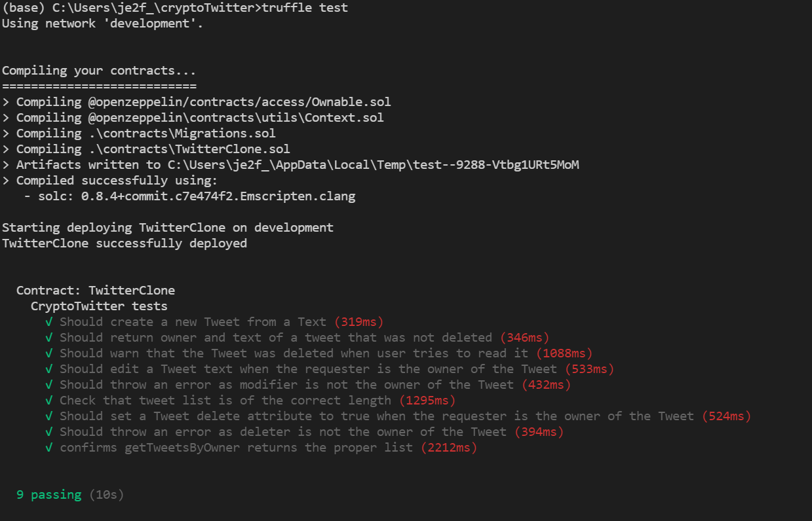
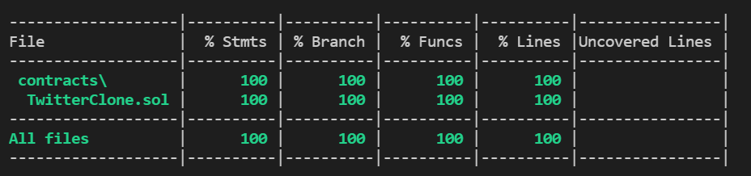

# crypto-twitter
Basic Tweeter clone on blockchain

## Contract main functions:
```createTweet(string memory _tweetText)```
This function creates a tweet from the text passed in argument _tweetText. The Tweet is store in a list of tweets.  
```editTweet(uint256 _tweetId, string memory _newText)```
This function allows to edit the text of a Tweet by passing the Id of the tweet and the new text.  
This function can only be executed by the owner of the Tweet (using the modifier ```ownerOf```).  
```deleteTweet(uint256 _tweetId)```
This function allows to delete a Tweet by passing the Id of the tweet.   
Tweet status is modified to record that it has been deleted and will not be showed on front end.    
This function can only be executed by the owner of the Tweet (using the modifier ```ownerOf```).  
```getTweetsByOwner(address _owner)``` 
This function returns the list of tweet Ids of a specific owner when passing their address as an attribute.
## Results of code testing
To be noted that the tests on the Tweet list tests have a strange behaviour as sometime they don't pass (at least on local development environment). 
### Truffle test command
  
### Truffle run coverage command
